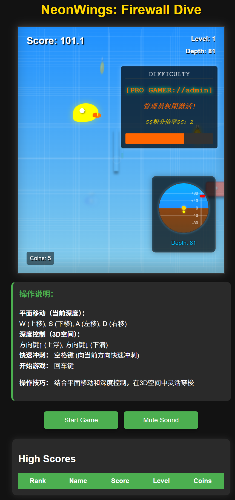

# NeonWings: Firewall Dive / 霓虹之翼：防火墙潜行

A high-score chasing game soaring through 3D space.  
**难度随分数动态提升，但积分翻倍！**  
Will you become a legend... or just coast along?  
**是成为传奇，还是混吃等死？由你决定！**
---
## 🌐 [Play Now / 立即游玩](https://askme765cs.github.io/neonwings/)
➡️   
*(无需下载，点击即玩)*
*(No need to download,click to run)*

---

## 🎮 Core Mechanics / 核心机制
### Dynamic Difficulty / 动态难度
- Speed increases with score (Max +300%)  
**速度随分数提升（最高+300%）**
- Score multiplier grows with risk-taking  
**高风险操作获得积分倍率加成**
### Reward System / 奖励系统
| Power-up       | Effect                          | 道具效果                     |
|----------------|---------------------------------|----------------------------|
| **Shrink Egg** | 50% size reduction for 8s      | **缩小蛋**：8秒内体型缩小50%  |
| **Force Field**| Invincibility for 5s           | **屏蔽罩**：5秒无敌状态       |
| **Boost Rocket**| Dash+Invincibility (Wall crash gives bonus!) | **冲刺火箭**：冲刺无敌状态，撞墙额外加分 |

---
## Controls / 操作说明
### Movement / 平面移动（当前深度）
- **W** (Up) / **W** (上移)  
- **S** (Down) / **S** (下移)  
- **A** (Left) / **A** (左移)  
- **D** (Right) / **D** (右移)  
### Depth Control / 深度控制（3D空间）
- **↑ Arrow** (Ascend) / **方向键↑** (上浮)  
- **↓ Arrow** (Descend) / **方向键↓** (下潜)  
### Special / 特殊操作
- **Spacebar** (Dash) / **空格键** (向当前方向快速冲刺)  
- **Enter** (Start Game) / **回车键** (开始游戏)  
---

## Pro Tips / 操作技巧
- Combine plane movement with depth control for fluid 3D navigation  
**结合平面移动和深度控制，在3D空间中灵活穿梭**  
- Dash through tight gaps when difficulty increases  
**难度升高时，用冲刺穿越狭窄缝隙**  
---

